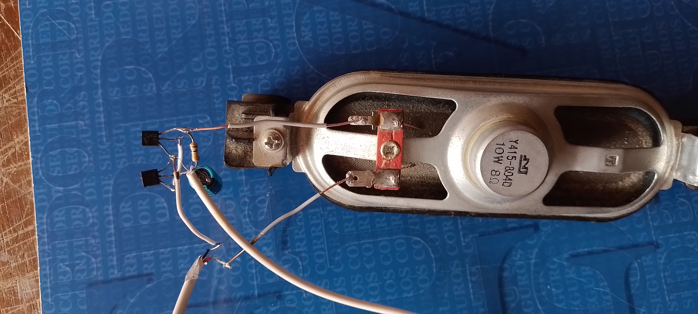

# Amplificador-de-audio-casero
Mini amplificador de audio casero usando transistores BC337 y BC327.

## Materiales
- Transistor NPN BC337
- Transistor PNP BC327
- Resistencia de 100 KΩ
- Capacitor de 470uF de 10v - 35v
- Cable Auxiliar
- Cable USB
- Speaker de 4 a 8 Ω

## Diagrama

## Montaje final
Para ver la demostración hacer click en la primera imagen para descargar el video.

